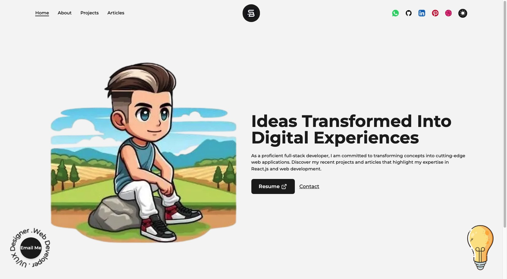

<a name="top"></a>

# Wsite - The Personal App

## Badges


## Demo



---

## Tech Stack

### Frontend

- React/Next
- Vite
- TailwindCSS

### Backend

- Node.js
- Express
- Nodemailer
- dotenv

### Deployment

- Vercel

### Altri Strumenti

- Axios
- CORS
- Body-Parser

## Getting Started

## Prerequisites

  ```sh
  **Node.js**: Scarica e installa Node.js da [nodejs.org](https://nodejs.org/). Verifica l'installazione con:
    node -v
    npm -v
    git -v
  ```

## Installation

```sh
  git clone https://github.com/Simobara/progMywebsite.git
  cd wsite
  npm install
  npm run dev
```

## Dependencies

<details >
<a name="top1"></a>
   <summary> Click </summary>

```sh
developer-portfolio-starter-code@0.1.0
├── ajv@8.16.0
├── autoprefixer@10.4.19
├── eslint-config-next@14.2.3
├── eslint@8.57.0
├── framer-motion@10.18.0
├── next@14.2.3
├── node-fetch@3.3.2
├── postcss@8.4.38
├── react-dom@18.2.0
├── react@18.2.0
├── tailwindcss@3.4.4
└── uri-js@4.4.1
```

[⤴️ top1](#top1)
</details>

## License

This project is licensed under the MIT License.
See the LICENSE file for more details.

## Link

-  - [click here](https://www.linkedin.com/in/siba2410)
-  - [click here](https://github.com/Simobara)
-  - [click here](https://www.youtube.com/watch?v=dQw4w9WgXcQ)

[⤴️ top](#top)
